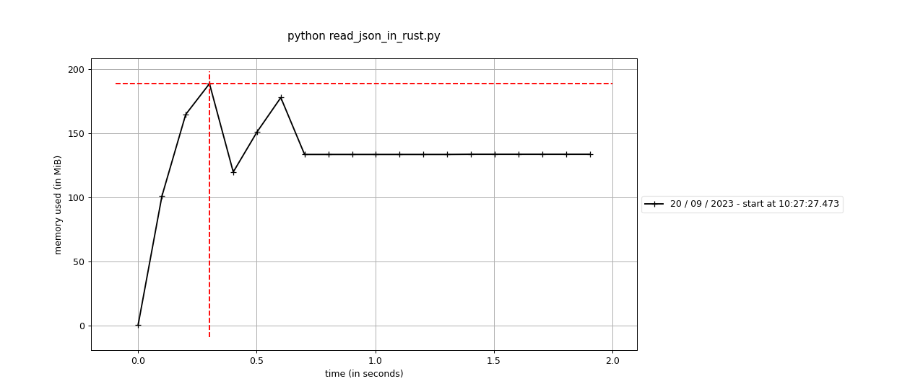

# Read JSON in Rust

[Rust](https://www.rust-lang.org/) is a system-level programming language that is compiled ahead of time (like Java, C, C++ ,...).

In this tutorial we are going to read JSON and possible parse it.

You can follow along at your own computer or at [replit.com](https://replit.com)

## Python example

We begin by looking at an example from karp-backend-5 where we read and update an JSON file.

```python
import json
import time
import typing


def main():
    start = time.perf_counter()

    data_source = load_from_file("data/skbl.json")

    def doc_update(doc):
        doc["_source"]["lexiconName"] = "skbl2"
        doc["_source"]["lexiconOrder"] = 48
        return doc

    for doc in data_source:
        doc_update(doc)

    dump_to_file(data_source, "data/skbl2_py.json")

    elapsed  = time.perf_counter() - start
    print(f"Elapsed time: {elapsed} s")


def load_from_file(path: str) -> typing.Any:
    with open(path) as file:
        return json.load(file)

def dump_to_file(value: list[typing.Any], path: str):
    with open(path, mode="w") as file:
        json.dump(value, file)


if __name__ == "__main__":
    main()
```

When running it we get this:
```bash
> python read_json_in_rust.py
Elapsed time: 0.7634601149984519 s
```
Memory usage:


## Rewrite that in rust

We begin with that timings,

### Setting up a cargo project

`cargo` is Rust's package manager, we can create a project:
```bash
> cargo new read-json-in-rust
    Created binary (application) `read-json-in-rust` package
```

If we `cd` into the directory we can run our application:
```bash
> cd read-json-in-rust
> cargo run
   Compiling read-json-in-rust v0.1.0 (.../read-json-in-rust)
    Finished dev [unoptimized + debuginfo] target(s) in 0.85s
     Running `target/debug/read-json-in-rust`
Hello, world!
```

Working correctly, and this is the code:
```rust
fn main() {
    println!("Hello, world!");
}
```

We have a function (`fn`) `main` that uses a macro (invoked with `!` after) to print `Hello, world!` with new-line to `stdout`.
The macro is because rust functions can't handle variadic functions, but rust macros can.
